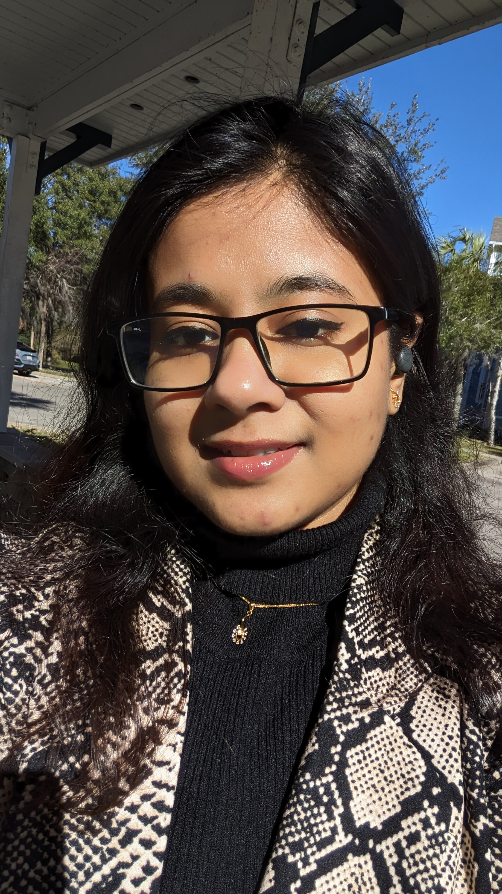

<link rel="stylesheet" href="https://cdnjs.cloudflare.com/ajax/libs/font-awesome/6.5.2/css/all.min.css">
<nav class="topbar">
  <a href="#">About</a>
  <a href="#news">News</a>
  <a href="#publications">Publications</a>
  <a href="#education">Education</a>
  <a href="#service">Service</a>
  <a href="#teaching">Teaching</a>
  <a href="#awards">Awards</a>
  <a href="#misc">Misc</a>
</nav>
<meta name="robots" content="noimageindex">

  
  

    
Ph.D. Student · Department of Computer &amp; Information Sciences University of Delaware

    

      <a href="mailto:fadiba@udel.edu"><i class="fa-solid fa-envelope"></i>Email</a>
      <a href="https://scholar.google.com/citations?user=hKT7FvAAAAAJ&hl=en"><i class="fa-solid fa-graduation-cap"></i>Google Scholar</a>
      <a href="https://github.com/FarzanaAdiba"><i class="fa-brands fa-github"></i>GitHub</a>
      <a href="https://www.linkedin.com/in/farzana-islam-adiba-19695615a"><i class="fa-brands fa-linkedin"></i>LinkedIn</a>
      <a href="assets/FarzanaAdiba_CV2026_last.pdf"><i class="fa-solid fa-file-lines"></i>CV</a>
    

  

I am a second-year Ph.D. student in the [Department of Computer & Information Sciences](https://www.cis.udel.edu/) at the
[University of Delaware (UD)](https://www.udel.edu/), work in [HealthylAife](https://sites.udel.edu/healthylaife/) advised by Prof.
[Rahmatollah Beheshti](https://sites.udel.edu/rbi/). My current research is on **bias and fairness in medical large language models**, where I analyze the impact of clinically sensitive attributes and their consequences on clinical fairness. More broadly, I work on AI for
health equity, clinical decision support, and health informatics.

Before UD, I completed a Master's focusing on AI in Healthcare Initiatives at the University of Florida, and I finished my M.Sc./B.Sc. degrees in Computer Science and Engineering at Jahangirnagar University, Bangladesh.

---

## News

- **Aug 2026** - Serving as Reviewer for ML4H Symposium (Machine Learning for Health) 2026.
- **Jul 2026** — Serving on the Program Committee for the **AAAI 2027** AI for Social Impact track.
- **Apr 2026** - Served as Reviewer for Machine Learning for Healthcare (MLHC) 2026.
- **Jan 2026** — Preprint: *A Multimodal Data Processing Pipeline for MIMIC-IV Dataset* ([arXiv:2601.11606](https://arxiv.org/abs/2601.11606)).
- **Jul 2025** — Preprint: *Tell Me You're Biased Without Telling Me You're Biased* ([arXiv:2507.21176](https://arxiv.org/abs/2507.21176)).
- **Jun 2025** — Scoping review on bias and fairness in medical LLMs posted ([OSF](https://doi.org/10.31219/osf.io/fqejh_v1)).
- **Sep 2024** — Started my Ph.D. at the University of Delaware.

---

## Publications

**Journal**

- Ruba Sajdeya, Mamoun T. Mardini, Patrick J. Tighe, Ronald L. Ison, Chen Bai, Sebastian Jugl, Hanzhi Gao,
  Kimia Zandbiglari, **Farzana Islam Adiba**, Almut G. Winterstein, Thomas A. Pearson, Robert L. Cook, Masoud Rouhizadeh.
  *Developing and validating a natural language processing algorithm to extract preoperative cannabis use status
  documentation from unstructured narrative clinical notes.*
  **JAMIA**, 30(8):1418–1428, 2023. [doi](https://doi.org/10.1093/jamia/ocad080)
- **Farzana Islam Adiba**, Tahmina Islam, M. Shamim Kaiser, Mufti Mahmud, Muhammad Arifur Rahman.
  *Effect of corpora on classification of fake news using Naive Bayes classifier.* **IJAAIML**, 1(1), 2020.

**Conference**

- **Farzana Islam Adiba**, Mohammad Zahidur Rahman.
  *Machine Learning Models to Analyze the Effect of Drugs on Neonatal-ICU Length of Stay.*
  **AII 2022**, CCIS vol. 1724, Springer. [doi](https://doi.org/10.1007/978-3-031-24801-6_14)
- **Farzana Islam Adiba**, Sharmin Nahar Sharwardy, Mohammad Zahidur Rahman.
  *Multivariate Time Series Prediction of Pediatric ICU Data Using Deep Learning.*
  **ICITIIT 2021**, Kottayam, India. [doi](https://doi.org/10.1109/ICITIIT51526.2021.9399593)

**Preprints**

- **Farzana Islam Adiba**, Varsha Danduri, Fahmida Liza Piya, Ali Abbasi, Mehak Gupta, Rahmatollah Beheshti.
  *A Multimodal Data Processing Pipeline for MIMIC-IV Dataset.*
  [arXiv:2601.11606](https://arxiv.org/abs/2601.11606) ·
  [code](https://github.com/healthylaife/MIMIC-IV-Data-Pipeline)
- **Farzana Islam Adiba**, Rahmatollah Beheshti.
  *Tell Me You're Biased Without Telling Me You're Biased — Toward Revealing Implicit Biases in Medical LLMs.*
  [arXiv:2507.21176](https://arxiv.org/abs/2507.21176) ·
  [code](https://github.com/healthylaife/LLM-KG-Bias)
- **Farzana Islam Adiba**, Yifan Zhang, Rahmatollah Beheshti.
  *Bias and Fairness in Medical LLMs: An Extensive Scoping Review.*
  [OSF](https://doi.org/10.31219/osf.io/fqejh_v1)
- Elise Omaki\*, **Farzana Islam Adiba**\*, Muhammad Bilal, Shobhan Kumar, Kimia Zandbiglari, Masoud Rouhizadeh.
  *A Comparative Study of Machine Learning and Deep Learning Techniques for Classifying Pediatric Fall Injuries Using NLP on NEISS Narratives.* (\*equal contribution)

---

## Education

- **Ph.D. in Computer Science** — University of Delaware, Newark, DE. *Fall 2024 – present*
- **M.S. in AI in Healthcare Initiatives**, University of Florida, Gainesville, FL. *2024*
- **M.Sc. in Computer Science and Engineering** — Jahangirnagar University, Dhaka, Bangladesh. *2019 – 2022*
- **B.Sc. in Computer Science and Engineering** — Jahangirnagar University, Dhaka, Bangladesh. *2015 – 2019*

---

## Service

- **Program Committee** — AAAI AI for Social Impact Track (2027); Workshop on Bangla Language Processing @ EMNLP (2023–present)
- **Reviewer** — CHIL (2025–present), MLHC (2024–present), ML4H (2025), DAIH @ COLM (2026), AMIA Informatics (2023–present)

---

## Teaching

- **University of Delaware** — TA, CISC220 Data Structures (Fall 2024 – Spring 2025)
- **University of Florida** — TA, PHA6805 Applied Data Analysis and Interpretation (Fall 2023)
- **University of Information Technology and Sciences (UITS), Dhaka** — Lecturer, Dept. of CSE (2022 – present, on study leave). Numerical Methods, Computer Networks, Linux Programming, DBMS, Structured Programming (Java)

---

## Awards

- POP Programmer Award, University of Florida (2023)
- National Science and Technology (NST) Fellowship, Ministry of Science and Technology, Bangladesh (2020–2021)
- Bangladesh Government Scholarship for undergraduate academic performance (2015–2019)
- Jahangirnagar University Supplementary Scholarship (2015–2019)
- Jahangirnagar University Scholarship — 1st position, undergraduate admission test (2014–2015)

---
## Misc
**Books.** My reading list at [Goodreads](https://www.goodreads.com/user/show/53268366-adiba-farzana)
